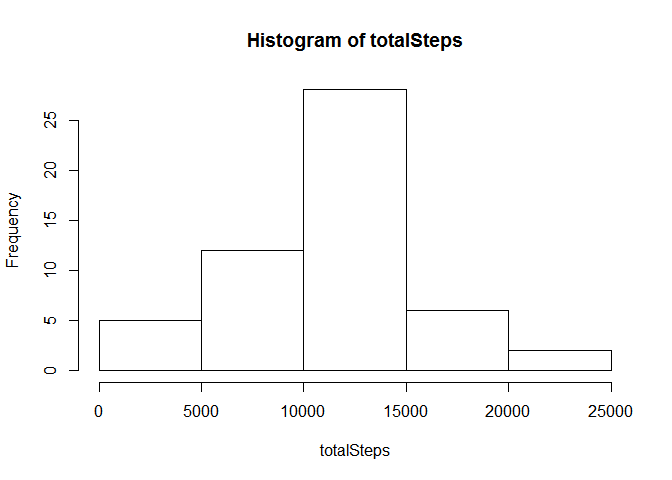
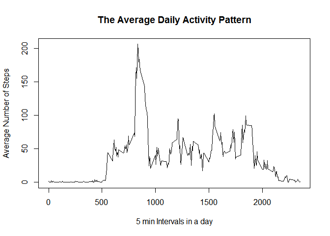
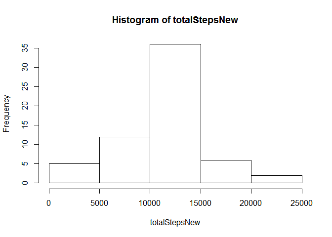
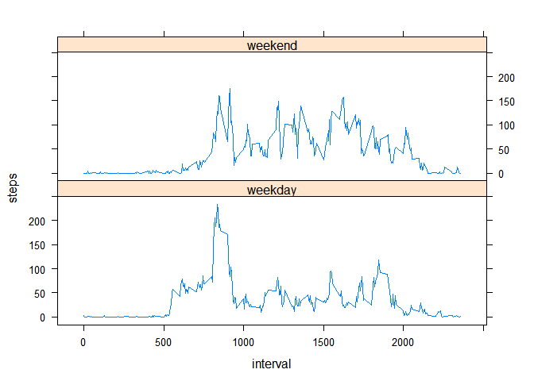

# Reproducible Research: Peer Assessment 1
XZW0005  
Friday, July 10, 2015  


## Loading and preprocessing the data
The data for this assignment can be downloaded from the course web site. First, we are going to load the data in R:

```r
activity = read.csv("./activity.csv")
summary(activity)
```

```
##      steps                date          interval     
##  Min.   :  0.00   2012-10-01:  288   Min.   :   0.0  
##  1st Qu.:  0.00   2012-10-02:  288   1st Qu.: 588.8  
##  Median :  0.00   2012-10-03:  288   Median :1177.5  
##  Mean   : 37.38   2012-10-04:  288   Mean   :1177.5  
##  3rd Qu.: 12.00   2012-10-05:  288   3rd Qu.:1766.2  
##  Max.   :806.00   2012-10-06:  288   Max.   :2355.0  
##  NA's   :2304     (Other)   :15840
```

```r
mydata = as.data.frame(activity[complete.cases(activity), ])
summary(mydata)
```

```
##      steps                date          interval     
##  Min.   :  0.00   2012-10-02:  288   Min.   :   0.0  
##  1st Qu.:  0.00   2012-10-03:  288   1st Qu.: 588.8  
##  Median :  0.00   2012-10-04:  288   Median :1177.5  
##  Mean   : 37.38   2012-10-05:  288   Mean   :1177.5  
##  3rd Qu.: 12.00   2012-10-06:  288   3rd Qu.:1766.2  
##  Max.   :806.00   2012-10-07:  288   Max.   :2355.0  
##                   (Other)   :13536
```

## What is mean total number of steps taken per day?

For this part of the assignment, we will ignore the missing values in the dataset. 

First, we are going to calculate the total number of steps taken for each day.

```r
totalSteps = tapply(mydata$steps, mydata$date, sum)
```
Then we make a histogram of the total number of steps taken each day.

```r
hist(totalSteps)
```

 

Next, we need to calculate and report the mean and median total number of steps taken per day.

```r
meanTotSteps = mean(totalSteps, na.rm = TRUE)
meanTotSteps
```

```
## [1] 10766.19
```

```r
medianTotSteps = median(totalSteps, na.rm = TRUE)
medianTotSteps
```

```
## [1] 10765
```
So we obtained the mean of the total number of steps taken per day is 10766.19, and the median is 10765.

## What is the average daily activity pattern?

```r
avgDailyPattern = aggregate(mydata$steps, by = list(mydata$interval), FUN = mean)
summary(avgDailyPattern)
```

```
##     Group.1             x          
##  Min.   :   0.0   Min.   :  0.000  
##  1st Qu.: 588.8   1st Qu.:  2.486  
##  Median :1177.5   Median : 34.113  
##  Mean   :1177.5   Mean   : 37.383  
##  3rd Qu.:1766.2   3rd Qu.: 52.835  
##  Max.   :2355.0   Max.   :206.170
```

```r
plot(avgDailyPattern[, 1], avgDailyPattern[, 2], type = "l", 
     xlab = "5 min Intervals in a day", 
     ylab = "Average Number of Steps", 
     main = "The Average Daily Activity Pattern")
```

 

```r
maxStepsInterval = avgDailyPattern[which.max(avgDailyPattern[, 2]), 1]
maxStepsInterval
```

```
## [1] 835
```
Therefore, across all the days in the dataset on average, the 5-minute interval contains the maximum number of steps is 8:35 am. 

## Imputing missing values
Note that there are a number of days/intervals where there are missing values (coded as NA). The presence of missing days may introduce bias into some calculations or summaries of the data.

*  First, we calculate the total number of missing values in the dataset:

```r
sum(!complete.cases(activity))
```

```
## [1] 2304
```
Thus, the total number of missing values in the dataset is 2304.

* The strategy we are going implement for imputing missing values is to use the mean for the 5-minute interval. 

* We are to create a new dataset that is copied from the original data but with the missing values filled in by using the stragegy mentioned above.

```r
newdata = activity
len1 = nrow(newdata)
len2 = nrow(avgDailyPattern)
for (i in 1:len1) {
  if (is.na(newdata$steps[i])) {
    for (j in 1:len2) {
      if (newdata$interval[i] == avgDailyPattern[j, 1]) {
        newdata$steps[i] = avgDailyPattern[j, 2]
      }
    } 
  }    
}
summary(newdata)
```

```
##      steps                date          interval     
##  Min.   :  0.00   2012-10-01:  288   Min.   :   0.0  
##  1st Qu.:  0.00   2012-10-02:  288   1st Qu.: 588.8  
##  Median :  0.00   2012-10-03:  288   Median :1177.5  
##  Mean   : 37.38   2012-10-04:  288   Mean   :1177.5  
##  3rd Qu.: 27.00   2012-10-05:  288   3rd Qu.:1766.2  
##  Max.   :806.00   2012-10-06:  288   Max.   :2355.0  
##                   (Other)   :15840
```

* Now, for the new dataset, we are going to calculate the total number of steps taken for each day, and then make a histogram of the total number of steps taken each day.

```r
totalStepsNew = tapply(newdata$steps, newdata$date, sum)
hist(totalStepsNew)
```

 

* Next, we need to calculate and report the mean and median total number of steps taken per day.

```r
meanTotStepsNew = mean(totalStepsNew, na.rm = TRUE)
meanTotStepsNew
```

```
## [1] 10766.19
```

```r
medianTotStepsNew = median(totalStepsNew, na.rm = TRUE)
medianTotStepsNew
```

```
## [1] 10766.19
```

So we obtained the mean of the total number of steps taken per day is 10766.19, which is the same as that of the original dataset with missing value removed. And the median is 10766.19 again, which is different from the median calculated from the original dataset. This impact is simply because that we add the 2304 values with the mean of the 5-minute interval from the original dataset. As a resullt, the mean does not change, and the median moves towards to the mean value.

## Are there differences in activity patterns between weekdays and weekends?
* First, we need to create a new factor variable in the dataset with two levels -- "weekday" and "weekend" indicating whether a given date is a weekday or weekend day.

```r
mydata$weekday = TRUE
weekday = weekdays(as.POSIXct(mydata$date, format = "%Y-%m-%d" ))
for (i in 1:length(weekday)) {
  if (weekday[i] == "Saturday" | weekday[i] == "Sunday") {
    mydata$weekday[i] = FALSE
  }
}
dataWeekday = mydata[which(mydata$weekday == TRUE), ]
dataWeekend = mydata[which(mydata$weekday == FALSE), ]

avgWeekdayPattern = aggregate(dataWeekday$steps, 
                               by = list(dataWeekday$interval), 
                               FUN = mean)
names(avgWeekdayPattern) = c("interval", "steps")
avgWeekdayPattern$dayTag = "weekday"
avgWeekendPattern = aggregate(dataWeekend$steps, 
                              by = list(dataWeekend$interval), 
                              FUN = mean)
names(avgWeekendPattern)= c("interval", "steps")
avgWeekendPattern$dayTag = "weekend"

avgPattern = rbind(avgWeekdayPattern, avgWeekendPattern)
```

* Therefore, the combined new dataset contains the average number of steps per 5 minute, and includes a factor variable with two levels -- "weekday" and "weekend", indicating whether a given date is a weekday or weekend day.

* Now we are ready to make a panel plot  containing a time series plot (i.e. type = "l") of the 5-minute interval (x-axis) and the average number of steps taken, averaged across all weekday days or weekend days (y-axis). 

```r
library(lattice)
xyplot(steps ~ interval | dayTag, data = avgPattern, 
       type = "l", layout = c(1, 2))
```

 

* According to the time series plots, we can see that there are obvious differences in activity patterns between weekdays and weekends. During the weekdays, morning activities start earlier than the weekends, and 
there is a clear peak in the mornings, but less activity in the afternoons. While in weekends, although morning activities are much less than weekdays, but more steady activities last for a whole day.
